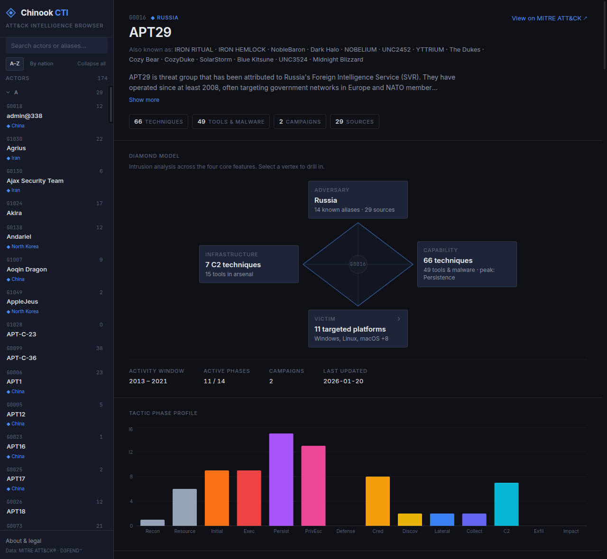
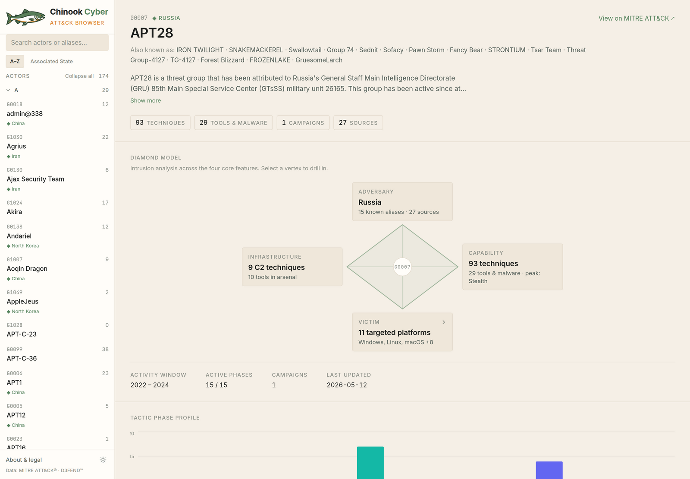

# Chinook Cyber — ATT&CK Browser

A threat-actor intelligence browser built around the **Diamond Model of Intrusion
Analysis**, sourced from MITRE ATT&CK® and enriched with MITRE D3FEND™ defensive
coverage. It reframes ATT&CK group data as adversary analysis — not a flat
directory — so you can see *how* an actor operates and *what counters it*.



## Features

- **Threat-landscape dashboard** — the home page opens on a curated overview:
  dataset stats, leaderboards (most active actors, most prevalent techniques,
  most-used software, most-targeted platforms), and an ATT&CK-Navigator-style
  coverage matrix shaded by how many tracked actors use each technique. A
  type-ahead launcher jumps to any actor or technique.
- **Diamond Model panel** — every actor mapped across the four core features
  (Adversary · Capability · Infrastructure · Victim) with a meta-features strip.
- **Tactic phase profile** — a Recharts bar chart of techniques across the 15
  ATT&CK tactics; click a bar to jump to that tactic.
- **Tabbed technique browser** — techniques grouped by tactic, each linking to
  its ATT&CK page, expandable for the group-specific use description.
- **Defensive coverage (D3FEND)** — countermeasures ranked by how many of the
  actor's techniques they address, grouped by D3FEND tactic; expand any
  countermeasure to see the exact ATT&CK techniques it correlates to (with D3-IDs).
- **Associated-state grouping** — the sidebar can group actors by the state named
  in their attribution text (heuristic), with collapsible sections.
- **Software, campaigns, and sources** — attributed malware/tools, campaigns, and
  the original MITRE reference reports.
- **Light / dark themes** and a **responsive layout** — the sidebar collapses to a
  drawer on small screens, so it works on mobile as well as desktop.

### Actor detail — the Diamond Model



## Stack

Vite · React 18 · TypeScript (strict) · Tailwind CSS · Zustand · React Router ·
Recharts. No UI component library — every component is hand-built.

## Data

To keep the live site fast, the MITRE datasets are **preprocessed at build time**
(`scripts/build-data.mjs`) into trimmed static JSON assets rather than pulling the
full ~47 MB STIX bundle and ~12 MB CSV into every visitor's browser:

- **MITRE ATT&CK** — the enterprise STIX bundle, trimmed to the object types and
  fields the app actually reads.
- **MITRE D3FEND** — the full ATT&CK→countermeasure mapping, precomputed into a
  compact lookup (D3-IDs bundled from the D3FEND ontology).

The clients load these local assets and fall back to fetching directly from MITRE
if they're absent (e.g. during `npm run dev` before a build). Generated assets are
git-ignored and regenerated on every build.

## Develop

```bash
npm install
npm run dev        # http://localhost:5173 (uses the live MITRE sources as a fallback)
npm run build:data # fetch MITRE + emit trimmed assets to public/data/ (optional for dev)
npm run build      # build:data + type-check + production build to dist/
npm run preview     # preview the production build
```

## Deploy

It's a static SPA — any static host works. The repo includes a `wrangler.jsonc`
for Cloudflare Workers static assets, with `single-page-application` not-found
handling so deep links resolve. `npm run build` produces `dist/`, fetching fresh
MITRE data at build time. (For Cloudflare Pages or Netlify instead, add a
`public/_redirects` containing `/* /index.html 200`.)

## Disclaimer

Chinook Cyber is an independent, non-commercial project for education and research.
It is **not affiliated with, endorsed by, or sponsored by The MITRE Corporation.**
All data is © The MITRE Corporation, reproduced under the
[ATT&CK Terms of Use](https://attack.mitre.org/resources/legal-and-branding/terms-of-use/)
and the [D3FEND Terms of Use](https://d3fend.mitre.org/resources/legal/). ATT&CK®
and D3FEND™ are trademarks of The MITRE Corporation. See the in-app **About &
legal** dialog for full attribution. Some fields (e.g. associated state) are
heuristic — always verify against the linked primary sources.
